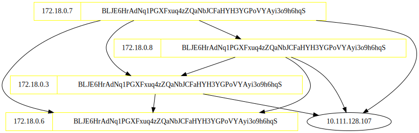

# tezos-net-viz

Generates graphs displaying how tezos nodes are connected to each other. Works 
by querying a given tezos node for its peers, and recursively crawling each node 
its connected to.

```sh
usage: tezos_net_viz [-h] [--rpc-port RPC_PORT] [--timeout TIMEOUT]
                     [--refresh-interval REFRESH_INTERVAL]
                     endpoint

positional arguments:
  endpoint              ip address or domain of tezos node to start exploring from

optional arguments:
  -h, --help            show this help message and exit
  --rpc-port RPC_PORT   rpc port of every node to explore
  --timeout TIMEOUT     connection timeout
  --refresh-interval REFRESH_INTERVAL
                        time until graph refresh
```

Example graph in a 5-node private chain:


