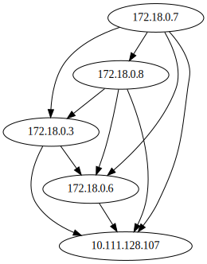

# tezos-net-viz

Generates graphs displaying how tezos nodes are connected to each other. Works 
by querying a given tezos node for its peers, and recursively crawling each node 
its connected to.

```sh
usage: visualize.py [-h] [--timeout TIMEOUT] endpoint

positional arguments:
  endpoint           ip address or domain of tezos node to start exploring from

optional arguments:
  -h, --help         show this help message and exit
  --timeout TIMEOUT  connection timeout
```

Example graph in a 5-node private chain:


